  

   
  Software engineering undergraduate, learning through projects and turning ideas into useful tools.

  <a href="https://skyjjgw.com">Personal website ↗</a> ·
  <a href="#currently-exploring">Exploring</a> ·
  <a href="#project-showcase">Projects</a> ·
  <a href="#how-i-work">How I work</a> ·
  <a href="#tech-stack--tools">Tech stack</a> ·
  <a href="https://github.com/skyjjgw/AI-practice-log">Learning log ↗</a>

  
  
  
  

---

## Currently exploring

I'm interested in **bringing AI into real software workflows**, from document retrieval and question answering to agents that use tools and desktop applications people can interact with directly.

I mainly use **Python / FastAPI** to build backend services and AI applications, while developing a stronger foundation in **Java / Spring Boot**. I enjoy connecting the whole workflow: data, user interactions, failure recovery, and deployment.

<table width="100%">
  <thead>
    <tr>
      <th width="260" align="left">Focus</th>
      <th width="900" align="left">Questions I'm exploring</th>
    </tr>
  </thead>
  <tbody>
    <tr>
      <td width="260"><strong>01 / AI applications</strong></td>
      <td width="900">How can documents be understood, retrieved, and turned into answers that can be verified?</td>
    </tr>
    <tr>
      <td width="260"><strong>02 / Software tools</strong></td>
      <td width="900">Can a tedious task become a simple, useful tool?</td>
    </tr>
    <tr>
      <td width="260"><strong>03 / Automation</strong></td>
      <td width="900">When a workflow fails, how can we find where it stopped and resume from there?</td>
    </tr>
  </tbody>
</table>

## Project showcase

### AI for practical problems

<table width="100%">
  <thead>
    <tr>
      <th width="260" align="left">Project</th>
      <th width="900" align="left">What I'm building</th>
    </tr>
  </thead>
  <tbody>
    <tr>
      <td width="260"><strong><a href="https://github.com/skyjjgw/An-edge-cloud-collaborative-assistive-navigation-system-for-visually-impaired-users">Assistive Navigation</a></strong></td>
      <td width="900">Exploring an assistive system that connects cloud services, edge vision, and volunteer support.</td>
    </tr>
    <tr>
      <td width="260"><strong><a href="https://github.com/skyjjgw/enterprise-rag-knowledge-base">Enterprise RAG</a></strong></td>
      <td width="900">Building a knowledge base application with document parsing, hybrid retrieval, and multi-step question answering.</td>
    </tr>
    <tr>
      <td width="260"><strong><a href="https://github.com/skyjjgw/BookTranslator">BookTranslator</a></strong></td>
      <td width="900">Connecting document extraction, AI translation, terminology reuse, and resumable processing.</td>
    </tr>
  </tbody>
</table>

### Tools for everyday tasks

<table width="100%">
  <thead>
    <tr>
      <th width="260" align="left">Project</th>
      <th width="900" align="left">What I'm building</th>
    </tr>
  </thead>
  <tbody>
    <tr>
      <td width="260"><strong><a href="https://github.com/skyjjgw/drip-browser-source">Drip Browser</a></strong></td>
      <td width="900">An Electron-based Windows browser exploring tabs and desktop interactions.</td>
    </tr>
    <tr>
      <td width="260"><strong><a href="https://github.com/skyjjgw/xmind-to-html">XMind → HTML</a></strong></td>
      <td width="900">Converting mind maps into interactive HTML files that open independently.</td>
    </tr>
    <tr>
      <td width="260"><strong><a href="https://github.com/skyjjgw/QuickNotes">QuickNotes</a></strong></td>
      <td width="900">A lightweight desktop notes tool with Markdown support and floating windows.</td>
    </tr>
  </tbody>
</table>

### Making experience reusable

**[FlowForge](https://github.com/skyjjgw/flowforge-workflow-studio)** · A browser workflow studio adapted from HumanJS, exploring recording, visual orchestration, and standalone application export. Still evolving.

**[Account Registration Skill](https://github.com/skyjjgw/account-registration-skill)** · A reusable skill for authorized signup workflows, covering email verification, page state detection, and recovery from interruptions.

**[AI Practice Log](https://github.com/skyjjgw/AI-practice-log)** · Learning notes, experiments, and project retrospectives.

## How I work

**Find a problem → Build a minimal version → Connect data and interactions → Validate and iterate**

I use AI coding tools to help with development, while learning to describe requirements clearly, read code, and verify results. This profile includes both more developed projects and ongoing experiments; I aim to document what each project can do and where its limits are.

## Tech stack & tools

  
  
  
  
  
  
  
  
  
  
  
  
  
  
  
  
  

Tools I use and study. Java / Spring Boot are marked as Learning.

---

  <b>Bring ideas to life, and leave a record of the journey.</b> 
  Learning in public · Building one useful thing at a time

