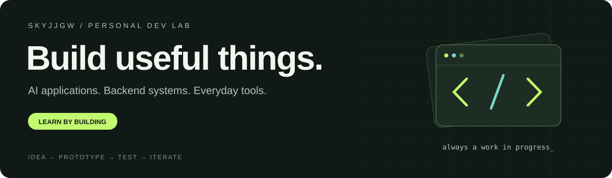

<p align="center">
  
</p>

<p align="center">
  <b>你好，我是 SKYJJGW。</b><br />
  软件工程本科在读，把学习写进项目，把想法做成可以使用的工具。
</p>

<p align="center">
  <a href="#正在探索">正在探索</a> ·
  <a href="#项目陈列室">项目陈列室</a> ·
  <a href="#我的工作方式">我的工作方式</a> ·
  <a href="#技术栈与工具">技术栈</a> ·
  <a href="https://github.com/skyjjgw/AI-practice-log">学习日志 ↗</a>
</p>

<p align="center">
  <a href="https://github.com/skyjjgw"></a>
  <a href="https://github.com/skyjjgw/AI-practice-log"></a>
</p>

---

## 正在探索

我对 **AI 怎样进入真实的软件流程** 很感兴趣：从文档检索与问答，到 Agent 调用工具，再到用户能直接操作的桌面应用。

目前主要用 **Python / FastAPI** 实践后端和 AI 应用，也在系统补齐 **Java / Spring Boot**。比起只做一个演示，我更想把数据流、页面交互、失败恢复和部署这些环节接起来。

| 方向 | 我关心的问题 |
| :--- | :--- |
| **01 / AI 应用** | 文档如何被理解、检索，并转化为可核对的回答？ |
| **02 / 软件工具** | 能不能把一个麻烦的操作，变成顺手的小工具？ |
| **03 / 自动化** | 流程失败后，怎样知道停在哪里、从哪里继续？ |

## 项目陈列室

### 让 AI 处理具体的问题

| 项目 | 在做什么 |
| :--- | :--- |
| **[视障辅助导航](https://github.com/skyjjgw/An-edge-cloud-collaborative-assistive-navigation-system-for-visually-impaired-users)** | 探索云端服务、边缘视觉感知与志愿者端协同的辅助系统。 |
| **[Enterprise RAG](https://github.com/skyjjgw/enterprise-rag-knowledge-base)** | 围绕文档解析、混合检索和多步问答构建知识库应用。 |
| **[BookTranslator](https://github.com/skyjjgw/BookTranslator)** | 尝试把文档提取、模型翻译、术语复用和断点恢复连成流程。 |

### 把日常操作做成工具

| 项目 | 在做什么 |
| :--- | :--- |
| **[Drip Browser](https://github.com/skyjjgw/drip-browser-source)** | 基于 Electron 的 Windows 浏览器，探索标签页和桌面交互。 |
| **[XMind → HTML](https://github.com/skyjjgw/xmind-to-html)** | 将思维导图转换为可独立打开的交互式 HTML。 |
| **[QuickNotes](https://github.com/skyjjgw/QuickNotes)** | 支持 Markdown 与悬浮窗口的轻量桌面笔记工具。 |

### 把重复经验沉淀下来

**[FlowForge](https://github.com/skyjjgw/flowforge-workflow-studio)** · 基于 HumanJS 改造的浏览器工作流工作台，探索录制、画布编排和独立程序导出，仍在迭代。

**[Account Registration Skill](https://github.com/skyjjgw/account-registration-skill)** · 将授权注册中的邮箱验证、页面状态判断和中断恢复整理成可复用技能。

**[AI Practice Log](https://github.com/skyjjgw/AI-practice-log)** · 留下学习笔记、实验过程和项目复盘。

## 我的工作方式

```text
发现一个具体问题
    ↓
先做出能验证的最小版本
    ↓
接通数据、接口与交互
    ↓
检查异常、记录结果、继续迭代
```

我会使用 AI 编程工具协助开发，也在学习如何更清楚地描述需求、阅读代码和验证结果。这里既有完整些的项目，也有进行中的实验；项目说明会尽量写清楚当前能力和边界。

## 技术栈与工具

**后端与编程**

<p>
  
  
  
  
</p>

**AI 与 Agent**

<p>
  
  
  
  
  
  
</p>

**界面与工程**

<p>
  
  
  
  
  
</p>

**正在学习**

<p>
  
  
</p>

这些标签代表目前使用或探索的工具；Java / Spring Boot 单独标注为学习中。


---

<p align="center">
  <b>让想法落地，也让过程留下痕迹。</b><br />
  <sub>Learning in public · Building one useful thing at a time</sub>
</p>
